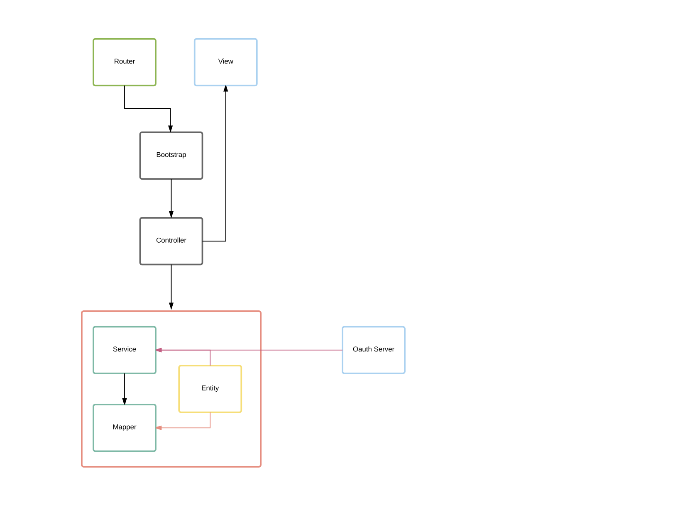
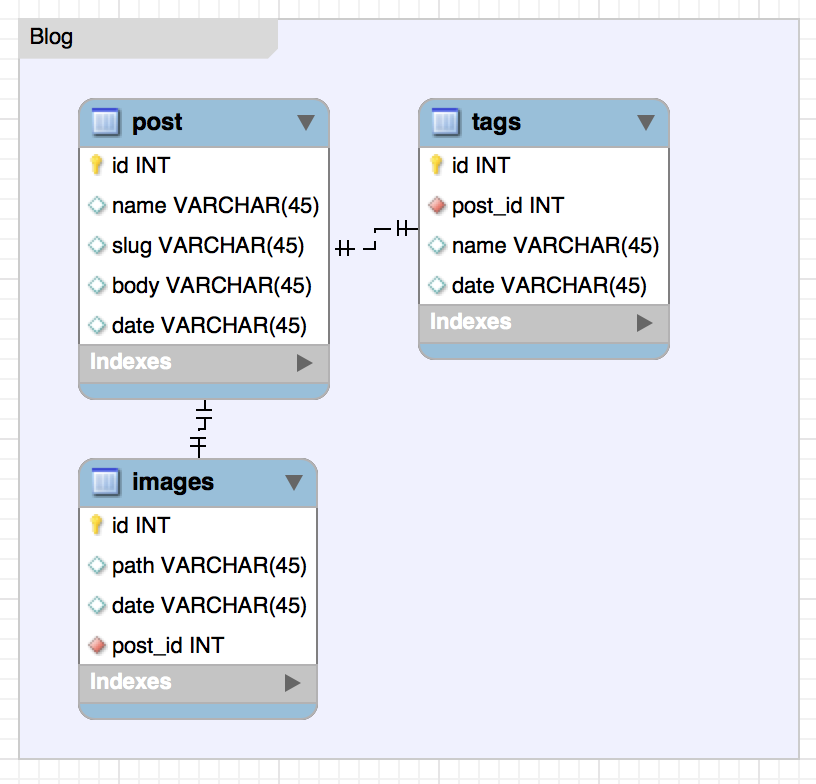
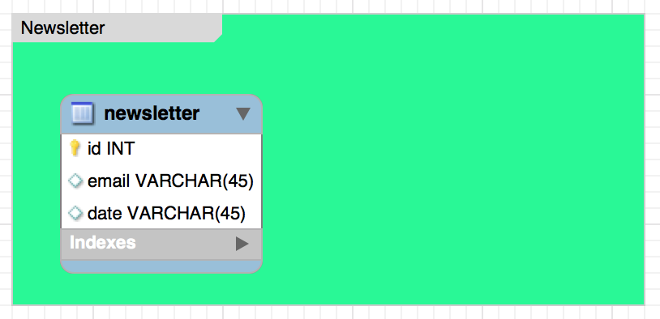

# RESTful API For a Blog

In the diagram i have explained the architecture of the blog.

The router will take the input, than it goes to the **bootstrap** class where we will load everything required by **DiC** 



The bussines logic is constructed in the model area where the **Service** will comunicate with the **Mapper** via the **Entitiy/Data Object**.

We wil handle **Auth** in the service.

I tried to keep the the rule of **"Skiny Controllers and fat Models"**


### The project tree
```sh
 .
├── README.md
├── composer.json
├── composer.lock
├── config
│   ├── config-development.yml
│   ├── dependencies
│   │   ├── common
│   │   │   ├── components.yml
│   │   │   ├── controllers.yml
│   │   │   └── services.yml
│   │   ├── development
│   │   │   └── db.yml
│   │   └── main.yml
│   ├── parameters
│   │   └── development
│   │       └── tables.yml
│   └── routing.yml
├── public
│   └── index.php
├── resources
│   ├── Logger
│   ├── assets
│   │   ├── icons
│   │   └── images
│   └── git
│       └── diagram.png
└── src
    └── Tech387
        ├── Bootstrap
        │   └── Bootstrap.php
        ├── Core
        │   ├── Component
        │   │   ├── DataMapper.php
        │   │   └── MapperFactory.php
        │   ├── Database
        │   │   └── PDOCompat.php
        │   ├── Exception
        │   │   ├── ControllerException.php
        │   │   ├── DatabaseException.php
        │   │   ├── MapperException.php
        │   │   └── ServiceException.php
        │   ├── Mapper
        │   │   └── CanCreateMapper.php
        │   └── OAuth2Server
        │       └── OAuth2.php
        ├── Models
        │   ├── Entities
        │   │   ├── Admin.php
        │   │   ├── Auth.php
        │   │   ├── Blog.php
        │   │   └── NewsLetter.php
        │   ├── Mappers
        │   │   ├── AdminMapper.php
        │   │   ├── AuthMapper.php
        │   │   ├── BlogMapper.php
        │   │   └── NewsLetterMapper.php
        │   └── Services
        │       ├── AdminService.php
        │       ├── AuthService.php
        │       ├── BlogService.php
        │       └── NewsLetterService.php
        └── Presentation
            └── Controller
                ├── AdminController.php
                └── AuthController.php
```

The `/config` folder hold yaml configurations for `services`, `controllers`, `mappers` etc....


The database is simpe, it only holds the `post` and the `newsletter` tables.





